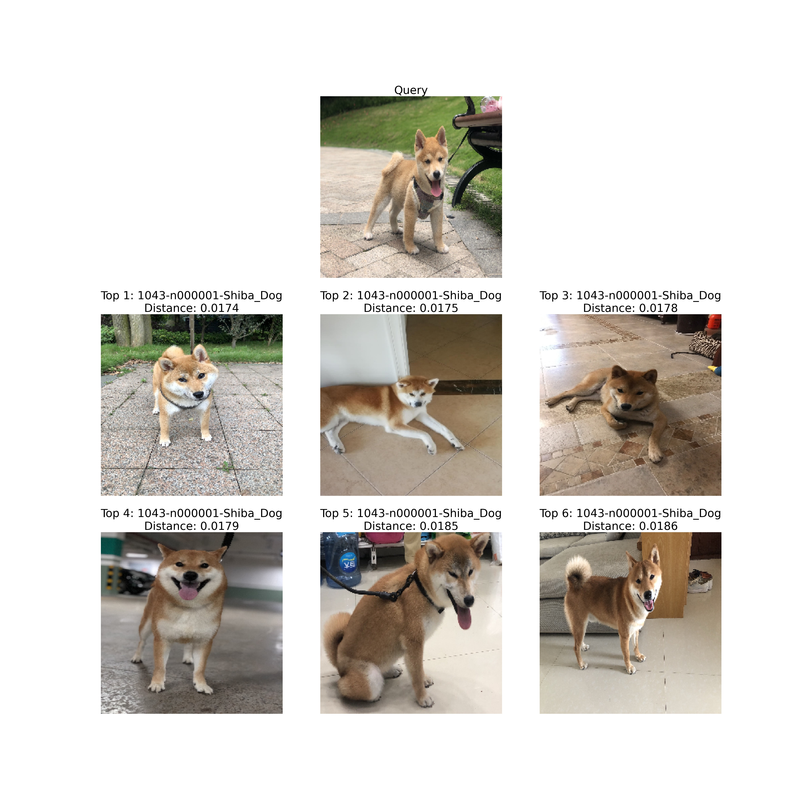
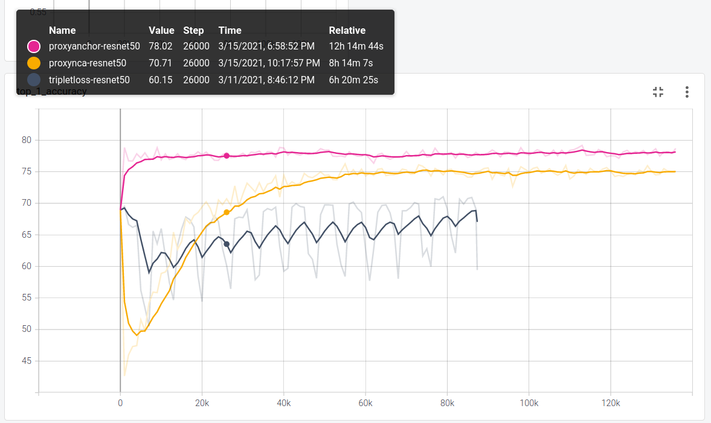
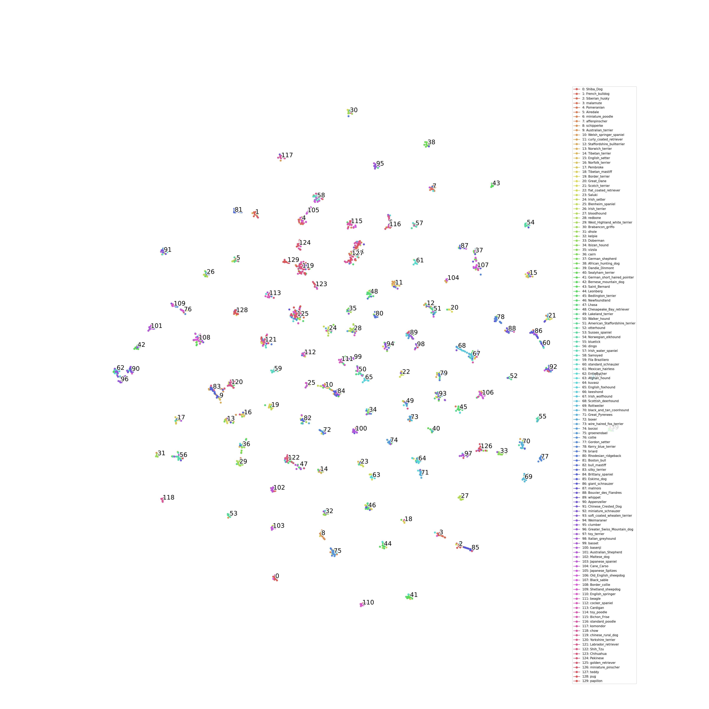
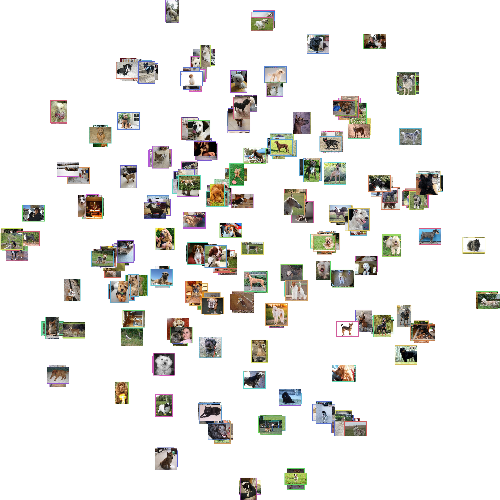
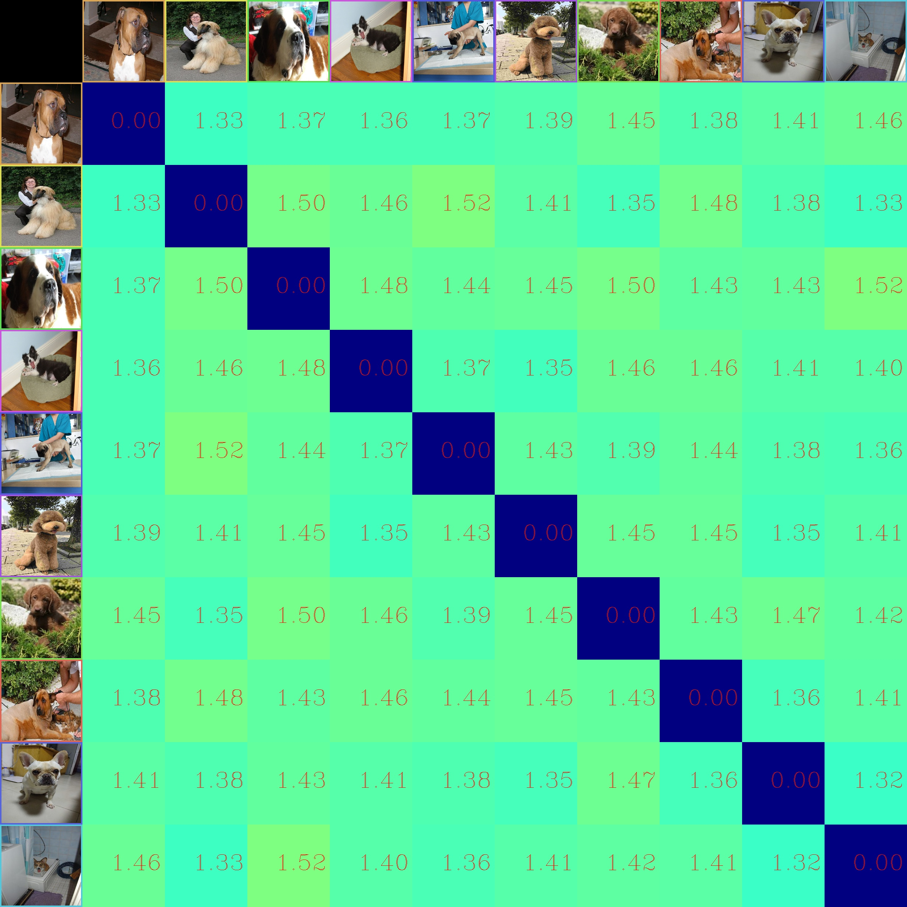

<div align="center">
    <h1>
    Tsinghua Dogs classification with
    <br>
    Deep Metric Learning
    </h1>
</div>


# 1. Introduction

## Tsinghua Dogs dataset
Tsinghua Dogs is a fine-grained classification dataset for dogs, over 65% of whose images are collected from people's real life. Each dog breed in the dataset contains at least 200 images and a maximum of 7,449 images. For more info, see [dataset's homepage](https://cg.cs.tsinghua.edu.cn/ThuDogs/).

Following is the brief information about the dataset:
- Number of categories: 130
- Number of training images: 65228
- Number of validating images: 5200


Variation in Tsinghua Dogs dataset. (a) Great Danes exhibit large variations in appearance, while (b) Norwich terriers and (c) Australian terriers are quite similar to each other. ([Source](https://cg.cs.tsinghua.edu.cn/ThuDogs))

## Deep metric learning
Deep metric learning (DML) aims to measure the similarity among samples by training a deep neural network and a distance metric such as Euclidean distance or Cosine distance.
For fine-grained data, in which the intra-class variances are larger than inter-class variances, DML proves to be useful in classification tasks.

## Goal
In this projects, I use deep metric learning to classify dog images in Tsinghua Dogs dataset. Those loss functions are implemented:
1. [Triplet loss](https://arxiv.org/abs/1503.03832)
2. [Proxy-NCA loss](https://arxiv.org/abs/1703.07464)
3. [Proxy-anchor loss](https://arxiv.org/abs/2003.13911)
4. [Soft-triple loss](https://arxiv.org/abs/1909.05235)

I also evaluate models' performance on some common metrics:

1. [Precision at k (P@K)](https://en.wikipedia.org/wiki/Evaluation_measures_(information_retrieval))
2. [Mean average precision (MAP)](https://en.wikipedia.org/wiki/Evaluation_measures_(information_retrieval))
3. [Top-k accuracy](https://stats.stackexchange.com/questions/156471/imagenet-what-is-top-1-and-top-5-error-rate)
4. [Normalized mutual information (NMI)](https://en.wikipedia.org/wiki/Mutual_information)

## Demo


<br>
<br>

# 2. Benchmarks
- Architecture: Resnet-50 for feature extractions.
- Embedding size: 128
- Batch size: 48
- Number of epochs: 100
- Online hard negatives mining
- Augmentations:
    - Random horizontal flip.
    - Random brightness, contrast and saturation.
    - Random affine with rotation, scale and translation.


|                   	    | MAP    	    | P@1    	    | P@5    	    | Top-1  	    | Top-5  	    | NMI    	| Download 	|
|-------------------	    |--------	    |--------	    |--------	    |--------	    |--------	    |--------	|----------	|
| Triplet loss      	    | 70.26% 	    | 70.92% 	    | 70.16% 	    | 70.92% 	    | 85.73% 	    | 82.00% 	|          	|
| Proxy-NCA loss    	    | 75.90% 	    | 76.00% 	    | 75.89% 	    | 76.00% 	    | 79.38% 	    | 81.43% 	|          	|
| Proxy-anchor loss 	    | 78.81% 	    | 79.17% 	    | 78.70% 	    | 79.17% 	    | 82.15% 	    | 83.09% 	|          	|
| **Soft-triple loss**  	| **79.92%** 	| **80.12%**	| **79.93%** 	| **80.12%** 	| **85.92%** 	| **85.11%** 	|          	|


<br>
<br>

# 3. Visualization on validation set
## Training logs



## Proxy-Anchor loss
### **T-SNE**



### **Similarity matrix**
- Each cell represent the L2 distance between 2 images.
- The closer distance to 0 (**blue**), the more **similar**.
- The larger distance (**green**), the more **dissimilar**.
- The diagonal represents the distance of an image to itself.


### **Confusion matrix**


## For visualization of other loss functions, check out directory [static](static/)

<br>
<br>

# 4. Inference
To inference, you should have a directory containing all reference images, for example:

```sh
reference_images_dir/
├── Affenpinscher
│   ├── Affenpinscher_00001.jpg
│   ├── Affenpinscher_00002.jpg
│   ├── ...
│   └── Affenpinscher_00078.jpg
├── ...
├── Airedale_terrier
│   ├── Airedale_terrier_00156.jpg
│   ├── Airedale_terrier_00157.jpg
│   ├── ...
│   └── Airedale_terrier_00217.jpg
└── Akita
    ├── Akita_00219.jpg
    ├── Akita_00223.jpg
    ├── ...
    └── Akita_00296.jpg
```

With above structure, you can have corresponding label for each retrieved images:
```sh
PYTHONPATH=./ python src/infer.py --image_path shiba.jpeg --reference_images_dir reference_images_dir --checkpoint_path src/checkpoints/TsinghuaDogs/proxynca-resnet50.pth --labeled_folders
```

Or all images in the same folder, however, you won't have corresponding label for each retrieved image with this way:
```sh
reference_images_dir/
├── Affenpinscher_00001.jpg
├── Affenpinscher_00002.jpg
├── ...
├── Airedale_terrier_00156.jpg
├── Airedale_terrier_00157.jpg
├── ...
├── Akita_00219.jpg
├── Akita_00223.jpg
├── ...
└── Akita_00296.jpg
```

```sh
PYTHONPATH=./ python src/infer.py --image_path shiba.jpeg --reference_images_dir reference_images_dir --checkpoint_path src/checkpoints/TsinghuaDogs/proxynca-resnet50.pth
```

# 5. Train
## 5.1 Install dependencies
```sh
# Create conda environment
conda create --name dml python=3.7 pip
conda activate dml

# Install pytorch and torchvision
conda install -n dml pytorch torchvision cudatoolkit=10.2 -c pytorch

# Install faiss for indexing and calulcating accuracy
# https://github.com/facebookresearch/faiss
conda install -n dml faiss-gpu cudatoolkit=10.2 -c pytorch

# Install other dependencies
pip install opencv-python tensorboard torch-summary torch_optimizer scikit-learn matplotlib seaborn requests ipdb flake8 pyyaml natsort
```

## 5.2 Download and prepare Tsinghua Dogs dataset
```sh
PYTHONPATH=./ python src/scripts/prepare_TsinghuaDogs.py --output_dir data/
```

Directory `data` should be like this:
```sh
data/
└── TsinghuaDogs
    ├── High-Annotations
    ├── high-resolution
    ├── TrainAndValList
    ├── train
    │   ├── 561-n000127-miniature_pinscher
    │   │   ├── n107028.jpg
    │   │   ├── n107031.jpg
    │   │   ├── ...
    │   │   └── n107218.jp
    │   ├── ...
    │   ├── 806-n000129-papillon
    │   │   ├── n107440.jpg
    │   │   ├── n107451.jpg
    │   │   ├── ...
    │   │   └── n108042.jpg
    └── val
        ├── 561-n000127-miniature_pinscher
        │   ├── n161176.jpg
        │   ├── n161177.jpg
        │   ├── ...
        │   └── n161702.jpe
        ├── ...
        └── 806-n000129-papillon
            ├── n169982.jpg
            ├── n170022.jpg
            ├── ...
            └── n170736.jpeg

```
## 5.3 Train model

- Train with proxy-nca loss
```sh
CUDA_VISIBLE_DEVICES=0 PYTHONPATH=./ python src/train.py --train_dir data/TsinghuaDogs/train --test_dir data/TsinghuaDogs/val --loss proxy_nca --config src/configs/proxy_nca_loss.yaml --checkpoint_root_dir src/checkpoints/proxynca-resnet50
```

- Train with proxy-anchor loss
```sh
CUDA_VISIBLE_DEVICES=0 PYTHONPATH=./ python src/train.py --train_dir data/TsinghuaDogs/train --test_dir data/TsinghuaDogs/val --loss proxy_anchor --config src/configs/proxy_anchor_loss.yaml --checkpoint_root_dir src/checkpoints/proxyanchor-resnet50
```

- Train with triplet loss
```sh
CUDA_VISIBLE_DEVICES=0 PYTHONPATH=./ python src/train.py --train_dir data/TsinghuaDogs/train --test_dir data/TsinghuaDogs/val --loss tripletloss --config src/configs/triplet_loss.yaml --checkpoint_root_dir src/checkpoints/tripletloss-resnet50
```

- Train with soft-triple loss
```sh
CUDA_VISIBLE_DEVICES=0 PYTHONPATH=./ python src/train.py --train_dir data/TsinghuaDogs/train --test_dir data/TsinghuaDogs/val --loss soft_triple --config src/configs/soft_triple_loss.yaml --checkpoint_root_dir src/checkpoints/softtriple-resnet50
```

Run `PYTHONPATH=./ python src/train.py --help` for more detail about arguments.

If you want to train on 2 gpus, replace `CUDA_VISIBLE_DEVICES=0` with `CUDA_VISIBLE_DEVICES=0,1` and so on.

If you encounter out of memory issues, try reducing `classes_per_batch` and `samples_per_class` in `src/configs/triplet_loss.yaml` or `batch_size` in `src/configs/your-loss.yaml`


<br>
<br>


# 6. Evaluate
To evaluate, directory `data` should be structured like this:
```sh
data/
└── TsinghuaDogs
    ├── train
    │   ├── 561-n000127-miniature_pinscher
    │   │   ├── n107028.jpg
    │   │   ├── n107031.jpg
    │   │   ├── ...
    │   │   └── n107218.jp
    │   ├── ...
    │   ├── 806-n000129-papillon
    │   │   ├── n107440.jpg
    │   │   ├── n107451.jpg
    │   │   ├── ...
    │   │   └── n108042.jpg
    └── val
        ├── 561-n000127-miniature_pinscher
        │   ├── n161176.jpg
        │   ├── n161177.jpg
        │   ├── ...
        │   └── n161702.jpe
        ├── ...
        └── 806-n000129-papillon
            ├── n169982.jpg
            ├── n170022.jpg
            ├── ...
            └── n170736.jpeg

```

## Plot confusion matrix
```sh
PYTHONPATH=./ python src/scripts/visualize_confusion_matrix.py --test_images_dir data/TshinghuaDogs/val/ --reference_images_dir data/TshinghuaDogs/train -c src/checkpoints/proxynca-resnet50.pth
```
## Plot T-SNE
```sh
PYTHONPATH=./ python src/scripts/visualize_tsne.py --images_dir data/TshinghuaDogs/val/ -c src/checkpoints/proxynca-resnet50.pth
```
## Plot similarity matrix
```sh
PYTHONPATH=./ python src/scripts/visualize_similarity.py  --images_dir data/TshinghuaDogs/val/ -c src/checkpoints/proxynca-resnet50.pth
```

For more detail about arguments in each script, run
```sh
PYTHONPATH=./ python src/scrips/{file}.py --help
```

<br>
<br>


## 7. Developement
```sh
.
├── __init__.py
├── README.md
├── src
│   ├── train.py  # Entry point for training
│   ├── infer.py  # Entry point for inferencing
│   ├── checkpoints  # Directory to save model's weights while training
│   ├── configs  # Configurations for each loss function
│   │   ├── proxy_nca_loss.yaml
│   │   ├── proxy_anchor_loss.yaml
│   │   ├── soft_triple_loss.yaml
│   │   └── triplet_loss.yaml
│   ├── dataset.py
│   ├── evaluate.py  # Calculate mean average precision, accuracy and NMI score
│   ├── __init__.py
│   ├── logs
│   ├── losses
│   │   ├── __init__.py
│   │   ├── proxy_nca_loss.py
│   │   ├── proxy_anchor_loss.py
│   │   ├── soft_triple_loss.py
│   │   └── triplet_margin_loss.py
│   ├── models
│   │   ├── __init__.py
│   │   └── resnet.py  # Model
│   ├── samplers
│   │   ├── __init__.py
│   │   └── pk_sampler.py  # Sample triplets in each batch for triplet loss
│   ├── scripts
│   │   ├── __init__.py
│   │   ├── prepare_TsinghuaDogs.py  # download and prepare dataset for training and validating
│   │   ├── visualize_confusion_matrix.py
│   │   ├── visualize_similarity.py
│   │   └── visualize_tsne.py
│   ├── trainer.py  # Helper functions for training
│   └── utils.py  # Some utility functions
└── static
```
