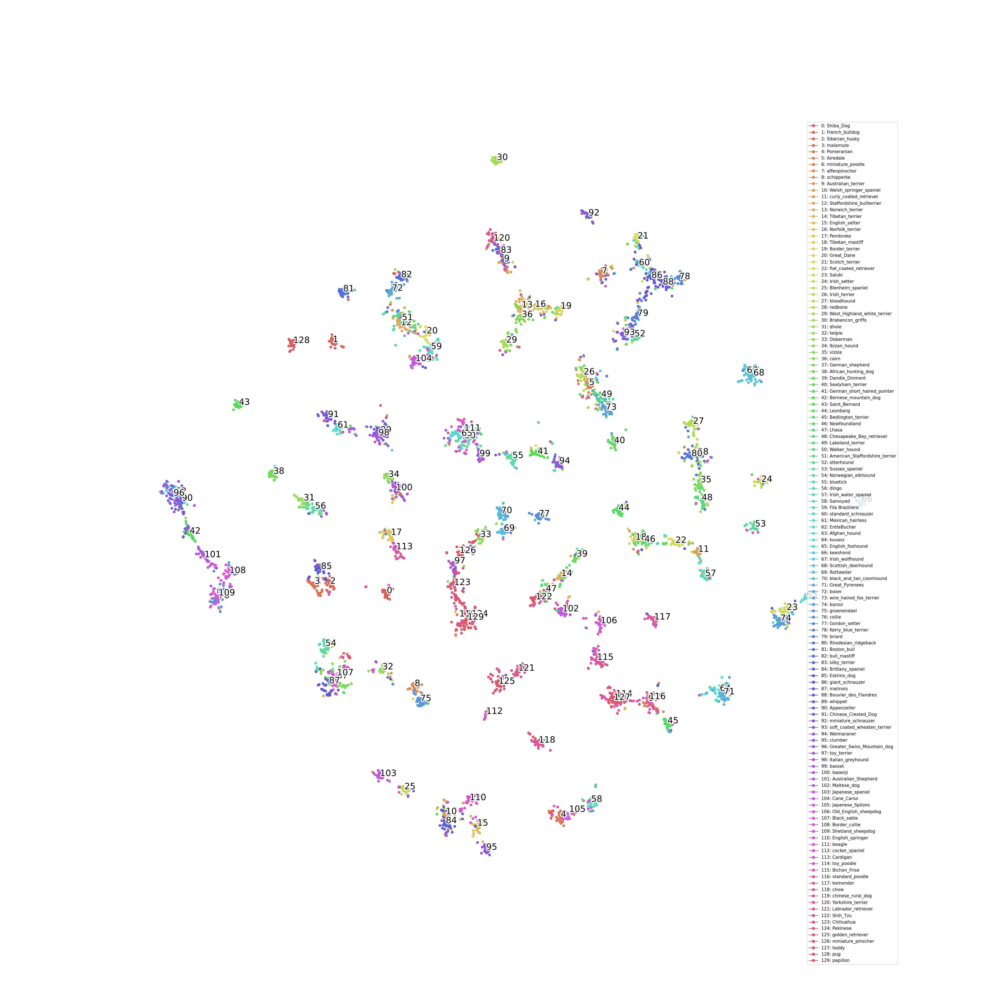
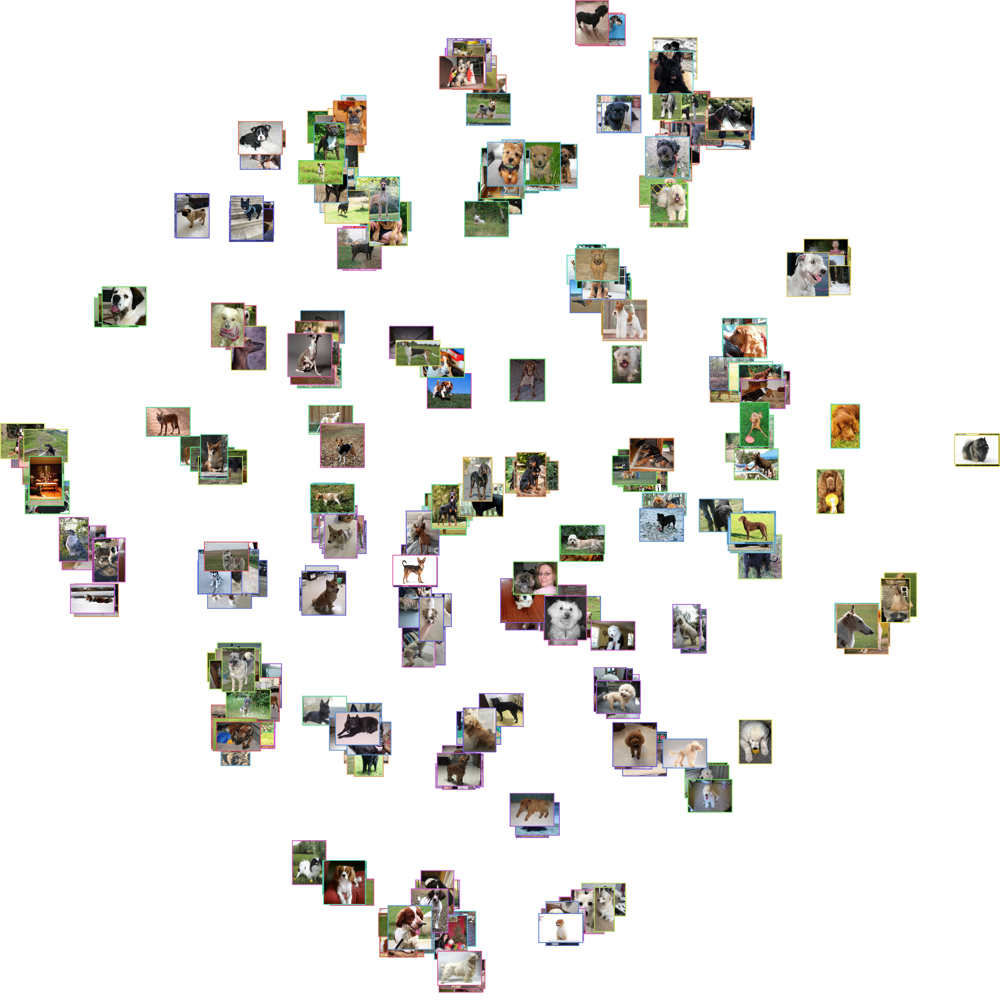
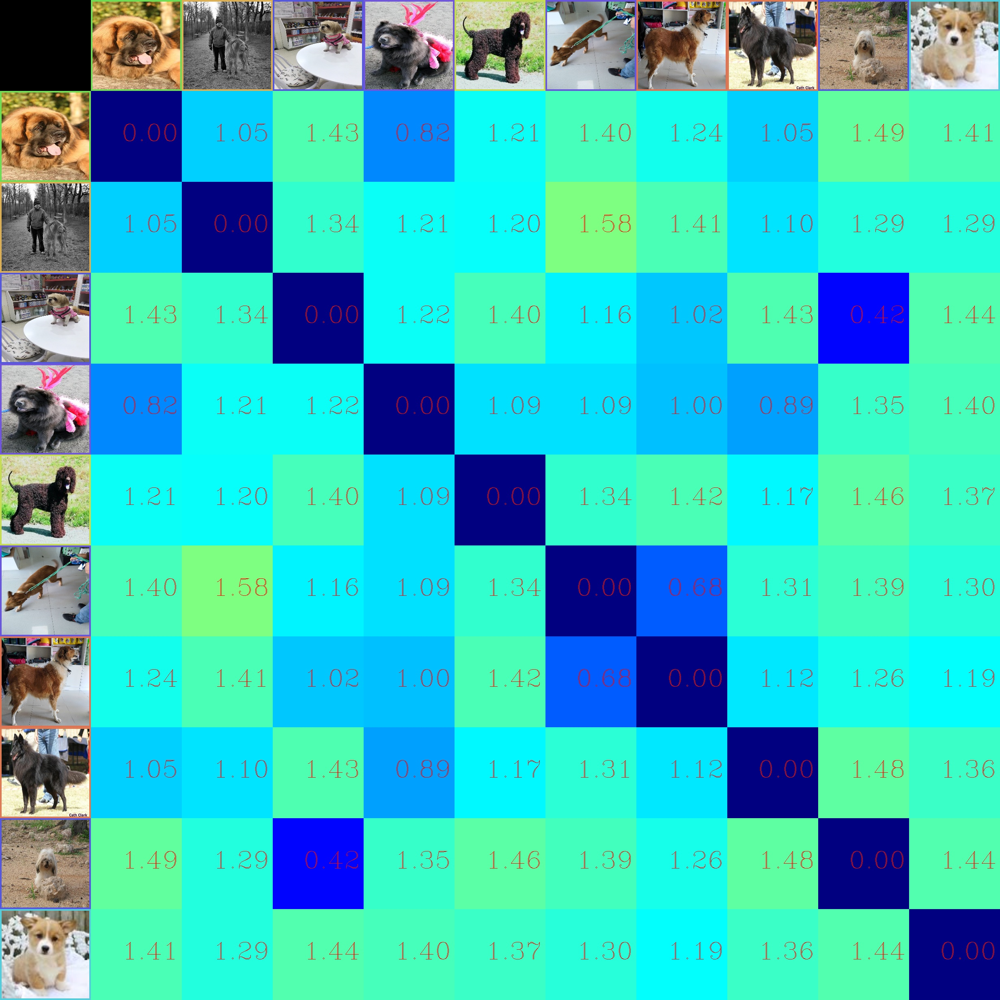

<div align="center">
    <h1>Tsinghua Dogs classification with Deep Metric Learning</h1>
</div>


# 1. Introduction

## Tsinghua Dogs dataset
Tsinghua Dogs is a fine-grained classification dataset for dogs, over 65% of whose images are collected from people's real life. Each dog breed in the dataset contains at least 200 images and a maximum of 7,449 images. For more info, see [dataset's homepage](https://cg.cs.tsinghua.edu.cn/ThuDogs/).

Following is the brief information about the dataset:
- Number of categories: 130
- Number of training images: 65228
- Number of validating images: 5200


Variation in Tsinghua Dogs dataset. (a) Great Danes exhibit large variations in appearance, while (b) Norwich terriers and (c) Australian terriers are quite similar to each other. ([Source](https://cg.cs.tsinghua.edu.cn/ThuDogs))

## Deep metric learning
Deep metric learning (DML) aims to measure the similarity among samples by training a deep neural network and a distance metric such as Euclidean distance or Cosine distance.
For fine-grained data, in which the intra-class variances are larger than inter-class variances, DML proves to be useful in classification tasks.

## Goal
In this projects, I use deep metric learning to classify dog images in Tsinghua Dogs dataset. Those loss functions are implemented:
1. [Triplet loss](https://arxiv.org/abs/1503.03832)
2. [Proxy-NCA loss](https://arxiv.org/abs/1703.07464)
3. [Proxy-anchor loss](https://arxiv.org/abs/2003.13911): In progress
4. [Soft-triple loss](https://arxiv.org/abs/1909.05235): In progress

I also evaluate models' performance on some common metrics:

1. [Precision at k (P@K)](https://en.wikipedia.org/wiki/Evaluation_measures_(information_retrieval))
2. [Mean average precision (MAP)](https://en.wikipedia.org/wiki/Evaluation_measures_(information_retrieval))
3. [Top-k accuracy](https://stats.stackexchange.com/questions/156471/imagenet-what-is-top-1-and-top-5-error-rate)
4. [Normalized mutual information (NMI)](https://en.wikipedia.org/wiki/Mutual_information)


<br>
<br>

# 2. Benchmarks
- Architecture: Resnet-50 for feature extractions.
- Embedding size: 128.
- Batch size: 48.
- Number of epochs: 100.
- Online hard negatives mining.
- Augmentations:
    - Random horizontal flip.
    - Random brightness, contrast and saturation.
    - Random affine with rotation, scale and translation.


|                   	| MAP    	| P@1    	| P@5    	| P@10   	| Top-5  	| NMI  	| Download 	|
|-------------------	|--------	|--------	|--------	|--------	|--------	|------	|----------	|
| Triplet loss      	| 73.85% 	| 74.66% 	| 73.90  	| 73.00% 	| 93.76% 	| 0.82 	|          	|
| Proxy-NCA loss    	| 89.10% 	| 90.26% 	| 89.28% 	| 87.76% 	| 99.39% 	| 0.98 	|          	|
| Proxy-anchor loss 	|        	|        	|        	|        	|        	|      	|          	|
| Soft-triple loss  	|        	|        	|        	|        	|        	|      	|          	|


<br>
<br>

# 3. Visualization
## Proxy-NCA loss
### **Confusion matrix on validation set**


### **T-SNE on validation set**


### **Similarity matrix of some images in validation set**
- Each cell represent the L2 distance between 2 images.
- The closer distance to 0 (**blue**), the more **similar**.
- The larger distance (**green**), the more **dissimilar**.


## Triplet loss
### **Confusion matrix on validation set**


### **T-SNE on validation set**



### **Similarity matrix of some images in validation set**
- Each cell represent the L2 distance between 2 images.
- The closer distance to 0 (**blue**), the more **similar**.
- The larger distance (**green**), the more **dissimilar**.


<br>
<br>


# 4. Train
## 4.1 Install dependencies
```sh
# Create conda environment
conda create --name dml python=3.7 pip
conda activate dml

# Install pytorch and torchvision
conda install -n dml pytorch torchvision cudatoolkit=10.2 -c pytorch

# Install faiss for indexing and calulcating accuracy
# https://github.com/facebookresearch/faiss
conda install -n dml faiss-gpu cudatoolkit=10.2 -c pytorch

# Install other dependencies
pip install opencv-python tensorboard torch-summary torch_optimizer scikit-learn matplotlib seaborn requests pprint ipdb
```

## 4.2 Prepare Tsinghua Dogs dataset
```sh
python src/scripts/prepare_TsinghuaDogs.py --output_dir data/
```
## 4.3 Train model with different losses and configs

- Train with proxy-nca loss
```sh
CUDA_VISIBLE_DEVICES=0 PYTHONPATH=./ python src/main.py --train_dir data/TsinghuaDogs/train --test_dir data/TsinghuaDogs/val --loss proxy_nca --config src/configs/proxy_nca_loss.yaml --checkpoint_root_dir src/checkpoints/proxynca-resnet50
```

- Train with triplet loss
```sh
CUDA_VISIBLE_DEVICES=0 PYTHONPATH=./ python src/main.py --train_dir data/TsinghuaDogs/train --test_dir data/TsinghuaDogs/val --loss tripletloss --config src/configs/triplet_loss.yaml --checkpoint_root_dir src/checkpoints/tripletloss-resnet50
```

Run `PYTHONPATH=./ python src/main.py --help` for more detail about arguments.

If you want to train on 2 gpus, replace `CUDA_VISIBLE_DEVICES=0` with `CUDA_VISIBLE_DEVICES=0,1` and so on.

If you encounter out of memory issues, try reducing `classes_per_batch` and `samples_per_class` in `src/configs/triplet_loss.yaml` or `batch_size` in `src/configs/your-loss.yaml`


<br>
<br>


# 5. Evaluate
To evaluate model, directory `data` should be structured like this:
```sh
data/
└── TsinghuaDogs
    ├── train
    │   ├── 561-n000127-miniature_pinscher
    │   │   ├── n107028.jpg
    │   │   ├── n107031.jpg
    │   │   ├── ...
    │   │   └── n107218.jp
    │   ├── ...
    │   ├── 806-n000129-papillon
    │   │   ├── n107440.jpg
    │   │   ├── n107451.jpg
    │   │   ├── ...
    │   │   └── n108042.jpg
    └── val
        ├── 561-n000127-miniature_pinscher
        │   ├── n161176.jpg
        │   ├── n161177.jpg
        │   ├── ...
        │   └── n161702.jpe
        ├── ...
        └── 806-n000129-papillon
            ├── n169982.jpg
            ├── n170022.jpg
            ├── ...
            └── n170736.jpeg


```

## Plot confusion matrix
```sh
PYTHONPATH=./ python src/scripts/visualize_confusion_matrix.py --test_images_dir data/TshinghuaDogs/val/ --reference_images_dir data/TshinghuaDogs/train -c src/checkpoints/proxynca-resnet50.pth
```
## Plot T-SNE
```sh
PYTHONPATH=./ python src/scripts/visualize_tsne.py --images_dir data/TshinghuaDogs/val/ -c src/checkpoints/proxynca-resnet50.pth
```
## Plot similarity matrix
```sh
PYTHONPATH=./ python src/scripts/visualize_similarity.py  --images_dir data/TshinghuaDogs/val/ -c src/checkpoints/proxynca-resnet50.pth
```


<br>
<br>


## 6. Developement
```sh
.
├── __init__.py
├── README.md
├── src
│   ├── main.py  # Entry point for training.
│   ├── checkpoints  # Directory to save model's weights while training
│   ├── configs  # Configurations for each loss function
│   │   ├── proxy_nca_loss.yaml
│   │   └── triplet_loss.yaml
│   ├── dataset.py
│   ├── evaluate.py  # Calculate mean average precision, accuracy and NMI score
│   ├── __init__.py
│   ├── logs
│   ├── losses
│   │   ├── __init__.py
│   │   ├── proxy_nca_loss.py
│   │   └── triplet_margin_loss.py
│   ├── models  # Feature extraction models
│   │   ├── __init__.py
│   │   └── resnet.py
│   ├── samplers
│   │   ├── __init__.py
│   │   └── pk_sampler.py  # Sample triplets in each batch for triplet loss
│   ├── scripts
│   │   ├── __init__.py
│   │   ├── prepare_TsinghuaDogs.py  # download and prepare dataset for training and validating
│   │   ├── visualize_confusion_matrix.py
│   │   ├── visualize_similarity.py
│   │   └── visualize_tsne.py
│   ├── trainer.py  # Helper functions for training
│   └── utils.py  # Some utility functions
└── static
    ├── proxynca-resnet50
    │   ├── confusion_matrix.jpg
    │   ├── similarity.jpg
    │   ├── tsne_images.jpg
    │   └── tsne_points.jpg
    └── tripletloss-resnet50
        ├── confusion_matrix.jpg
        ├── similarity.jpg
        ├── tsne_images.jpg
        └── tsne_points.jpg


```

## 7. Acknowledgement

    @article{Zou2020ThuDogs,
        title={A new dataset of dog breed images and a benchmark for fine-grained classification},
        author={Zou, Ding-Nan and Zhang, Song-Hai and Mu, Tai-Jiang and Zhang, Min},
        journal={Computational Visual Media},
        year={2020},
        url={https://doi.org/10.1007/s41095-020-0184-6}
    }
